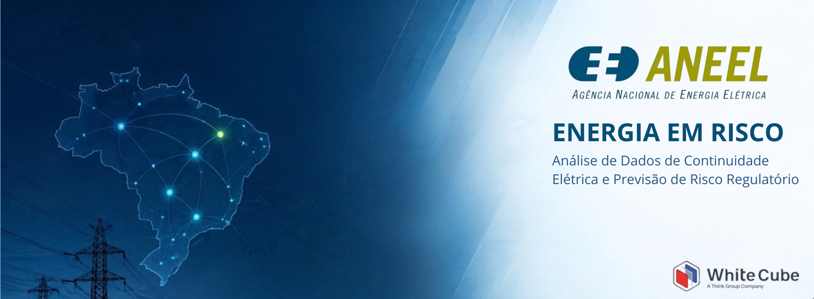
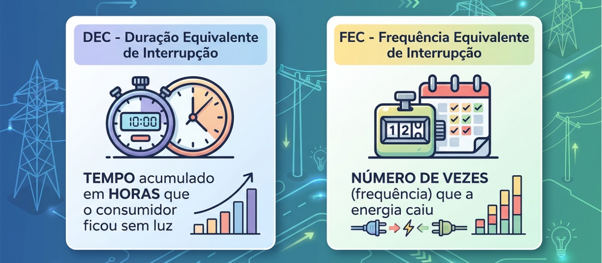
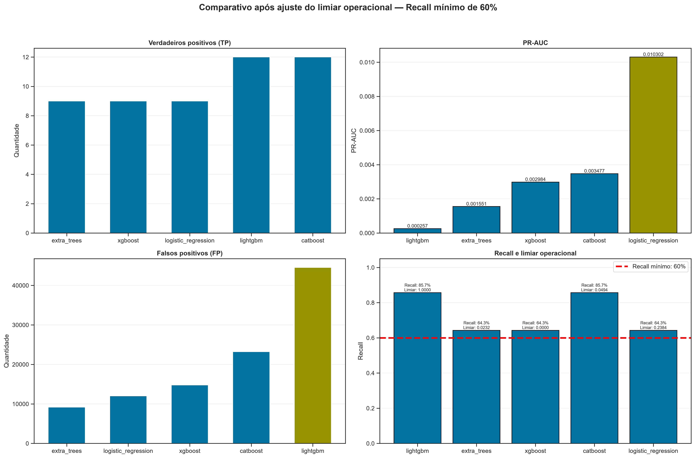
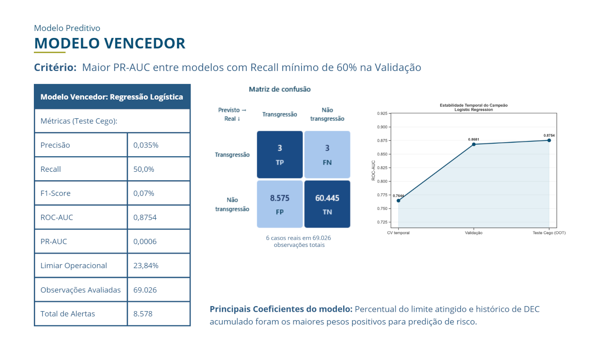
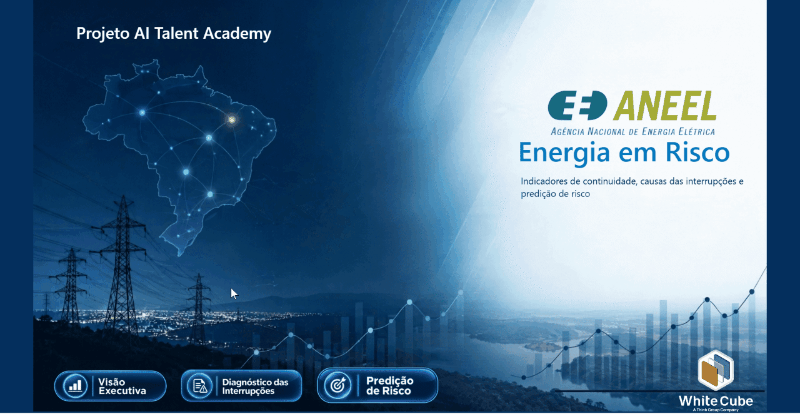

<p align="center">
  
</p>

---

# Projeto ANEEL - Energia em Risco
### *Análise de Dados de Continuidade Elétrica e Previsão de Risco Regulatório (ANEEL)*

<p align="left">
  
  
  
  
  
  
  
</p>

<p align="left">

  
  
  
  

</p>

---

## Descrição

Projeto de **Análise de Dados e Machine Learning** desenvolvido sobre dados públicos da Agência Nacional de Energia Elétrica (ANEEL), com foco no diagnóstico dos indicadores de continuidade do fornecimento elétrico (DEC e FEC) e na mitigação de riscos e compensações regulatórias no Brasil. Trabalho desenvolvido como projeto prático final da formação **AI Talent Academy**, da _White Cube_.

---

## Sumário

1. [Contextualização](#1-contextualização)
2. [Objetivo](#2-objetivo)
3. [Base de Dados](#3-base-de-dados)
4. [Tecnologias](#4-tecnologias)
5. [Entregáveis](#5-entregáveis)
6. [Fases do Projeto](#6-fases-do-projeto)
7. [Arquitetura](#7-arquitetura)<br />
7.1 [Pipeline ELT](#71-pipeline-elt)<br />
7.2 [Star Schema](#72-star-schema)<br />
8. [Estrutura de Diretórios](#8-estrutura-de-diretórios)
9. [Como Executar](#9-como-executar)
10. [Resultados e Validação](#10-resultados-e-validação)
11. [Limitações e Próximos Passos](#11-limitações-e-próximos-passos)
12. [Equipe](#12-equipe)

---

## 1. Contextualização

No setor de distribuição de energia elétrica no Brasil, a **Agência Nacional de Energia Elétrica (ANEEL)** estabelece metas e padrões contratuais estritos de qualidade por meio de dois indicadores coletivos de continuidade:

<p align="center">
  
  <br>
  <em>Fig.01 - DEC e FEC</em>
</p>

A transgressão desses limites regulatórios acarreta compensações financeiras obrigatórias repassadas diretamente na fatura dos consumidores afetados, impactando a receita líquida das concessionárias e sua reputação institucional.

---

## 2. Objetivo

Desenvolver uma solução integrada de Dados e Machine Learning para analisar o histórico do DEC e FEC e antecipar o risco de transgressão regulatória no período seguinte.

---

## 3. Base de Dados

Os dados utilizados são públicos e extraídos do portal de dados abertos da ANEEL. Para fins de análise e treinamento do modelo, o conjunto de dados foi delimitado a um período de 5 anos (**2021** a **2025**).

**Bases utilizadas:** 
1. [Indicadores Coletivos de Continuidade (DEC e FEC)](https://dadosabertos.aneel.gov.br/pt_BR/dataset/indicadores-coletivos-de-continuidade-dec-e-fec) 

2. [Interrupções de Energia Elétrica nas Redes de Distribuição)](https://dadosabertos.aneel.gov.br/dataset/interrupcoes-de-energia-eletrica-nas-redes-de-distribuicao)

3. [Limites Regulatórios](https://dadosabertos.aneel.gov.br/pt_BR/dataset/indicadores-coletivos-de-continuidade-dec-e-fec/resource/fd69e1dd-fd66-4269-b60c-cc0b7eb221b4)

4. [Atributos de Conjuntos](https://dadosabertos.aneel.gov.br/pt_BR/dataset/indicadores-coletivos-de-continuidade-dec-e-fec/resource/3c780aca-38cf-406d-9d45-f07a9216eef2)

5. [Indicadores por Município](https://dadosabertos.aneel.gov.br/dataset/indqual-municipio/resource/3f841488-80a8-42f2-a6ca-e0c593b228de)

---

### 4. Tecnologias

Tecnologia | Função |
| --- | --- |
|   | Execução do código e módulos do projeto |
|  | Transformação SQL e geração dos Parquets |
|  | Execução de testes automatizados |
|  <br>  | Apoio na leitura tabular e cálculos numéricos |
|  <br>  | Gráficos e diagnósticos estatísticos |
|  | Algoritmos de ML e testes estatísticos |
|  | Distribuições estatísticas (`scipy.stats.loguniform`) para otimização de hiperparâmetros |
|  | Controle de versão do repositório |
|  | Dashboard com telas analíticas de conformidade, diagnóstico de interrupções e predição de risco |

---

## 5. Entregáveis

Abaixo encontram-se os principais produtos e artefatos desenvolvidos:

| Entregável | Formato / Plataforma | Descrição | Link de Acesso |
| :--- | :--- | :--- | :--- |
| **Pipeline ELT** | Python (`.py`) / DuckDB (`.sql`) | Script automatizado (`main.py`) para orquestração e execução do pipeline de dados | [⚙️ Ver Código](./main.py) |
| **Notebooks de análise e modelagem** | Jupyter (`.ipynb`) | Fluxo completo documentado: auditoria, compreensão dos dados, EDA, preparação de dados, treinamento e comparação de modelos, e avaliação final | [📂 Explorar Pasta de Notebooks](./notebooks/) |
| **Modelo e Artefatos** | Joblib (`.joblib`) | Arquivos binário do modelo vencedor treinado e metadados de calibração do limiar | [💾 Acessar a Pasta Models](./models/) |
| **Pipeline de Inferência** | Python (`.py`) | Script automatizado (`run_inference.py`) para cálculo mensal dos scores e faixas de risco | [⚙️ Ver Código](./src/data/run_inference.py) |
| **Dashboard Power BI** | Power BI Service | Dashboard com telas analíticas de conformidade, diagnóstico de interrupções e predição de risco | [🔗 Acessar Dashboard Online](https://app.powerbi.com/view?r=eyJrIjoiMGYwOTI4ZWUtMjNiMi00OTI4LWJmYTAtZjM4MDY5YWZmODliIiwidCI6IjA2NjU1Y2NkLThkYmYtNDMzZi1iMjBkLWVlNGYyOTIyN2I1OSJ9) |
| **Apresentação Final** | PDF (`.pdf`) | Slides de apresentação do projeto no demo day | [📄 Ver Apresentação](./reports/final_presentation.pdf) |
| **Documentação Complementar** | Markdown (`.md`), CSV (`.csv`) e Parquet (`.parquet`) | Escopo do projeto, arquitetura do projeto, star schema, contrato de dados, dicionário de dados, orientações sobre integração do modelo no Power BI e metadados gerados dos notebooks | [📂 Explorar Pasta de Documentos](./docs/) |
| **Imagens e gráficos** | Imagem PNG (`.png`) | Imagens e gráficos gerados dos notebooks | [📂 Explorar Pasta de Figuras](./reports/figures/) |

---

## 6. Fases do Projeto

Desenvolvimento iterativo guiado pelo framework **CRISP-DM** e gerenciado via quadro Kanban:

<p align="left">
  <a href="https://github.com/users/vikpires/projects/7/views/4?sliceBy[columnId]=Milestone">
    
  </a>
</p>

| Fase CRISP-DM | Período | Principais Entregas |
| :--- | :---: | :--- |
| **1. Business Understanding (Compreensão do Negócio)** | Sem. 04 | Escopo, metas regulatórias, estrutura do repositório e ambiente de desenvolvimento. |
| **2. Data Understanding (Compreensão dos Dados)** | Sem. 05 | Pipeline ELT, modelo dimensional (Star Schema), auditoria de dados e EDA. |
| **3. Data Preparation (Preparação dos Dados)** | Sem. 06 | *Feature engineering* com defasagens (*lags*), tratamento de nulos e divisão temporal. |
| **4. Modeling (Modelagem)** | Sem. 07 | Benchmark de algoritmos, ajuste de limiar e telas analíticas no Power BI. |
| **5. Evaluation (Avaliação)** | Sem. 08 | Validação cega (2025), análise de resíduos, 4 faixas de risco e pipeline `run_inference.py`. |
| **6. Deployment (Implantação)** | Sem. 08 | Publicação do painel no Power BI Service, revisão dos artefatos e Demo Day. |

---

## 7. Arquitetura

### 7.1 Pipeline ELT

O projeto implementa um pipeline ELT local para transformar dados públicos da ANEEL em tabelas analíticas para consumo no formato *Parquet*. O processamento é executado pelo Python e DuckDB através de pipeline local na raiz do projeto (`main.py`)

<p align="center">
  
  <br>
  <em>Fig. 02 - Pipeline ELT (Arquitetura Medalhão)</em>
</p>


| Etapa | Ferramenta | Função | Volumetria |
| :--- | :--- | :--- | :--- |
| Camada Bronze |  | Extração e armazenamento local dos dados brutos do Portal da ANEEL. | **~50,6 Mi** de linhas |
| Camada Silver |   | Limpeza, tipagem, padronização temporal e recorte do período de análise (2021 a 2025) por meio de consultas SQL, usando DuckDB. | **~45 Mi** de linhas |
| Camada Gold |   | Agregação dos dados por conjunto e mês e geração das tabelas fato e dimensão em *Parquet*, com cálculo de DEC, FEC, limites e transgressões. | **~3,75 Mi** de linhas |
| Quality Gate |    | Etapa de validação das chaves, completude e integridade dos dados entre camadas para evitar inconsistências. | - |
| Consumo |  | Modelo dimensional em Star Schema (**2 tabelas fato** e **7 dimensões**) prontas para consumo analítico. | - |

Durante a execução, se uma etapa falhar, o pipeline é interrompido para evitar que dados inválidos avancem para a camada seguinte. No terminal, logs de saída apresentam cada ação executada no pipeline.

### 7.2 Star Schema

O Star Schema foi o modelo dimensionsal proposto para organizar o modelo em dimensões e fatos relacionados por chaves primárias e estrangeiras, permitindo análises por tempo, distribuidora, conjunto, indicador, tipo, motivo e causa de interrupção. Ao todo, são 9 tabelas criadas: 2 tabelas fato e 7 tabelas dimensão.

<p align="center">
  
  <br>
  <em>Fig. 03 - Star Schema</em>
</p>

---

## 8. Estrutura de Diretórios

```markdown
├── 📁 data/
│   ├── 📁 raw/            # Dados brutos originais (Camada Bronze)
│   ├── 📁 interim/        # Dados intermediários tratados (Camada Silver)
│   ├── 📁 external/       # Dados externos e bases de apoio
│   └── 📁 processed/      # Dados finais consolidados para consumo analítico (Camada Gold)
|       └── 📁 modeling/   # Dados e metadados de preparação do modelo
│
├── 📁 docs/               # Documentação técnica, arquitetura e dicionário de dados
│   └── 📁 assets/         # Imagens, fluxogramas e diagramas da documentação
|   └── 📁 metadata/       # Metadados gerados na execução dos notebooks
│
├── 📁 models/             # Artefatos e arquivos de modelos treinados
├── 📁 notebooks/          # Notebooks Jupyter para análise exploratória e prototipagem
├── 📁 pbix/               # Relatórios e modelos de dados do Power BI
├── 📁 references/         # Manuais normativos, notas técnicas e materiais de consulta (Se houver)
├── 📁 reports/            # Relatórios consolidados e apresentações executivas
│   └── 📁 figures/        # Imagens e gráficos gerados na execução dos notebooks
├── 📁 src/                # Código-fonte modular do projeto (extractors, transformers, fato_dim, quality gates e inference)
├── 📁 tests/              # Suíte de testes automatizados e regras do Quality Gate
|
├── 📄 .editorconfig       # Padronização de estilo de formatação entre diferentes editores e IDEs
├── 📄 .gitignore          # Regras de arquivos e pastas ignorados pelo Git
├── 📄 CONTRIBUTING.md     # Guia de contribuição, padrões de código e fluxo de Git
├── 📄 main.py             # Arquivo executável do pipeline ELT
├── 📄 LICENSE             # Termos de licença de uso e distribuição do projeto
├── 📄 README.md           # Apresentação geral, arquitetura e instruções de execução
├── 📄 requirements.txt    # Dependências e bibliotecas Python do projeto
└── 📄 setup_colab.py      # Script de automação e provisionamento de ambiente no Google Colab

```
---

## 9. Como Executar

**Pré-requisitos:**

* Python 3.11+
* Git

### 9.1. Opção 01: Execução Local

**1. Clonar o repositório do projeto**

```bash
git clone https://github.com/vikpires/projeto_aneel_equipe14.git
cd projeto_aneel_equipe14
```

**2. Configurar o ambiente virtual**

```bash
python -m venv .venv
source .venv/bin/activate  # No Windows/WSL
```

**3. Instalar dependências**

```bash
python -m pip install --upgrade pip
pip install -r requirements.txt

```

**4. Execução do pipeline ELT**

*4.1 Execução completa*

Na raiz do projeto, após a instalação das dependências execute o comando abaixo para rodar o pipeline de dados:

```bash
python main.py
```
O orquestrador local executa em sequência automatizada:

1. **Etapa 1:** `extractor.py` (Ingestão de dados) → extrai dados do Portal da ANEEL e armazenamento local na camada Bronze.
2. **Etapa 2:** `quality_raw.py`(Quality Gate da Camada Bronze) → Valida os dados brutos baixados e a consistência dos dados.
3. **Etapa 3:** `transformer.py`(Transformação) → limpeza, padronização de tipos, recorte temporal (2021 a 2025) e armazenamento local como arquivos no formato *Parquet* na camada Silver.
4. **Etapa 4:** `quality_interim.py`(Quality Gate da Camada Silver) → Valida os dados tratados, a estrutura e o recorte temporal do projeto a fim de evitar vazamento de dados.
5. **Etapa 5:** `fato_dim.py`(Star Schema Dimensional) → Agregação dos dados por conjunto e mês e criação das tabelas fato e dimensão.
6. **Etapa 6:** `quality_processed.py`(Quality Gate da Camada Gold) → Validação final da estrutura das tabelas e consistência das chaves e relações.
7. **Etapa 7:** (Consumo) → Tabelas fato e dimensão geradas e prontas para consumo analítico.

Todas as etapas geram logs de saída via terminal e arquivos de manifesto para cada camada concluída.

*4.2 Execução por etapas individuais*

```bash

# Apenas ingestão (Bronze)
python -m extractor.py

# Apenas transformação (Silver)
python -m transformer.py

# Apenas processamento das tabelas fato e dimensão (Gold)
python -m fato_dim.py

```

**5. Conectar Star Schema no Power BI**
1. Obter dados > Parquet
2. Importar as 9 tabelas da camada Gold
  - `fato_continuidade.parquet`
  - `fato_causa_mensal.parquet`
  - `dim_data.parquet`
  - `dim_distribuidora.parquet`
  - `dim_conjunto.parquet`
  - `dim_indicador.parquet`
  - `dim_tipo_interrupcao.parquet`
  - `dim_motivo_interrupcao.parquet`
  - `dim_causa_interrupcao.parquet`

>[!WARNING]
>Não relacione fatos diretamente entre si. Use dimensões conformadas com cardinalidade 1:*.

**6. Execução do pipeline de inferência mensal**
- Para executar o script de inferência mensal que gera os dados para o Power BI:

```bash
python src/data/run_inference.py
```

**7. Execução dos testes automatizados (Opcional)**
- Para executar os testes automatizados com pytest:

```bash
pytest -v tests/
```

### 9.2. Opção 02: Execução via Google Colab
Acessar o notebook `00_download_release.ipynb` localizado na pasta [notebooks](./notebooks/) manualmente ou clicar no link abaixo:

[](https://colab.research.google.com/github/vikpires/projeto_aneel_equipe14.git/blob/main/notebooks/00_download_release.ipynb)

Executar as células para acessar os dados processados via release do GitHub.

---

## 10. Resultados

### 10.1. Métricas, desempenho e generalização do Modelo
* **Critério de Seleção:** O *benchmark* comparativo entre os algoritmos avaliados (Regressão Logística, Extra Trees, XGBoost, CatBoost e LightGBM) priorizou a maximização da **PR-AUC** aliada a um patamar mínimo de **60% de Recall** sob desbalanceamento severo.

<p align="center">
  
  <br>
  <em>Fig. 04: Comparativo de desempenho de métricas por algoritmo.</em>
</p>


* **Modelo Vencedor:** A **Regressão Logística** foi selecionada pela superioridade no balanço de precisão e estabilidade linear. Na validação cega (2025), o modelo atingiu **ROC-AUC de 0,8754** e **PR-AUC de 0,000624** (7,1× acima do *baseline* aleatório).

<p align="center">
  
  <br>
  <em>Fig. 05: Desempenho, matriz de confusão e métricas da Regressão Logística no conjunto de teste cego (2025).</em>
</p>

### 10.2. Integração Analítica no Power BI
* **Painel Executivo de Continuidade:** Visão macro da conformidade e evolução histórica dos limites regulatórios de DEC e FEC.

* **Painel de Diagnóstico de Interrupções:** Análise de causa-raiz (falhas não programadas vs. acidentais) e concentração geográfica.

* **Painel Preditivo de Risco:** Aplicação do modelo preditivo com filtro de priorização por distribuidora e conjunto elétrico.

<p align="center">
  
  <br>
  <em>Fig. 06: Dashboard Power BI.</em>
</p>

>[!TIP]
>💡 *Caso queira interagir com o dashboard em tempo real, clique [aqui](https://app.powerbi.com/view?r=eyJrIjoiMGYwOTI4ZWUtMjNiMi00OTI4LWJmYTAtZjM4MDY5YWZmODliIiwidCI6IjA2NjU1Y2NkLThkYmYtNDMzZi1iMjBkLWVlNGYyOTIyN2I1OSJ9).*

---

## 11. Limitações e Próximos Passos

* O modelo baseia-se em histórico regulatório, métricas defasadas (*lags*) e tendências de degradação da rede. Com isso, torna-se incapaz de antecipar transgressões causadas por causas pontuais e/ou acidentais, tais como tempestades atípicas ou queimadas.

* O número reduzido de transgressões nas partições temporais torna as métricas sensíveis a pequenas variações nos dados. Portanto, os resultados devem ser interpretados como evidências experimentais, e não como garantia de desempenho futuro.

* A granularidade mensal dos dados regulatórios da ANEEL mascara variações pontuais. Interrupções severas concentradas em poucos dias consecutivos não são capturadas como tendência prévia se o início do mês apresentou operação estável.

* Devido ao severo desbalanceamento de classes, conjuntos com histórico de estresse operacional contínuo recebem scores intermediários a altos, mesmo quando a distribuidora consegue evitar a transgressão no limite, demandando triagem pelas faixas de risco para que não haja uma sobrecarga de falsos positivos.

---

## 12. Equipe

<table>
  <tr>
    <td align="center">
      <a href="https://github.com/MarcelProgram">
        
      </a>
      <br />
      <sub><b>Antônio Marcel</b></sub>
      <br />
      <br />
      <a href="https://github.com/MarcelProgram">
        
      </a>
      <a href="https://linkedin.com/in/marcel-albuquerquesousa">
        
      </a>
    </td>
    <td align="center">
      <a href="https://github.com/Edy-Ap-Dias">
        
      </a>
      <br />
      <sub><b>Edivaldo Dias</b></sub>
      <br />
      <br />
      <a href="https://github.com/Edy-Ap-Dias">
        
      </a>
      <a href="https://linkedin.com/in/edivaldo-aparecido-dias-69aaa11b7">
        
      </a>
    </td>
    <td align="center">
      <a href="https://github.com/vsvilela39-oss">
        
      </a>
      <br />
      <sub><b>Vanessa Vilela</b></sub>
      <br />
      <br />
      <a href="https://github.com/vsvilela39-oss">
        
      </a>
      <a href="https://linkedin.com/in/vanessa-vilela-3836608a">
        
      </a>
    </td>
    <td align="center">
      <a href="https://github.com/vikpires">
        
      </a>
      <br />
      <sub><b>Vitor Pires</b></sub>
      <br />
      <br />
      <a href="https://github.com/vikpires">
        
      </a>
      <a href="https://linkedin.com/in/vitorspires">
        
      </a>
    </td>
  </tr>
</table>
